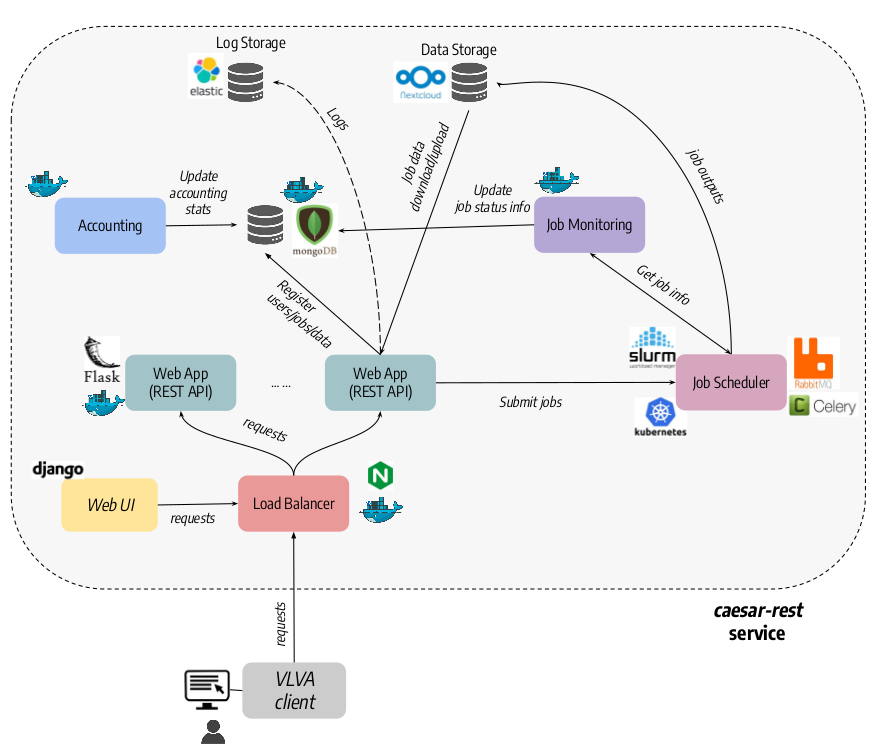

<p align="left">
  
</p>

# caesar-rest
caesar-rest is a REST-ful web service for astronomical source extraction and classification with the caesar source extractor [https://github.com/SKA-INAF/caesar]. The software is developed in python and consists of a few containerized microservices, deployable on standalone servers or on a distributed cloud infrastructure. The core component is the REST web application, based on the Flask framework and running behind a nginx+uwsgi http server, and providing APIs for managing the input data (e.g. data upload/download/removal) and source finding jobs (e.g. submit, get status, get outputs) with different job management systems (Kubernetes, Slurm, Celery). Additional services (AAI, user DB, log storage, job monitor, accounting) enable the user authentication, the storage and retrieval of user data and job information, the monitoring of submitted jobs, and the aggregation of service logs and user data/job stats.
Besides caesar, we also foresee to integrate other tools widely used in the radio community (e.g. Aegean, PyBDSF) and newly developed source finders based on deep learning models.    

## **Status**
This software is under development. Tested originally with python 2.7 but switched to python 3.6 later on (some apps are only available for python 3). 

## **Credit**
This software is distributed with GPLv3 license. If you use caesar-rest for your research, please add repository link or acknowledge authors in your papers.   

## **Installation**  

### **Install dependencies**
To run caesar rest service you need to install the following tools:  

* Flask [https://palletsprojects.com/p/flask/]     
* uwsgi [https://uwsgi-docs.readthedocs.io/en/latest/index.html]   
* nginx [https://nginx.org/]   
* mongodb [https://www.mongodb.com/]   
* flask-pymongo python module [https://flask-pymongo.readthedocs.io/en/latest/]  
* structlog python module [https://www.structlog.org/en/stable/]     

For the Celery-based job management, you need to install celery, a broker and a result backend service:   

* celery [http://www.celeryproject.org/]   
* broker: rabbitmq [https://www.rabbitmq.com/]    
* result backend: redis [https://redis.io/] or mongodb [https://www.mongodb.com/]     

For the Kubernetes-based job management, you need to install the Kubernetes python client library:    

* kubernetes [https://pypi.org/project/kubernetes/]

For the Slurm-based job management, you need to install these python modules:    

* requests [https://docs.python-requests.org/en/master/]    
* jwt [https://pypi.org/project/jwt/]     

To enable OpenID Connect based authentication you need to install:    

* flask-oidc-ex python module [https://pypi.org/project/flask-oidc-ex/] 

### **Package installation**
To build and install the package:    

* Create a local install directory, e.g. ```$INSTALL_DIR```
* Add installation path to your ```PYTHONPATH``` environment variable:   
  ``` export PYTHONPATH=$PYTHONPATH:$INSTALL_DIR/lib/python3.6/site-packages ```
* Build and install package:   
  ``` python3.6 setup.py sdist bdist_wheel```    
  ``` python3.6 setup build```   
  ``` python3.6 setup install --prefix=$INSTALL_DIR```   

All dependencies will be automatically downloaded and installed in ```$INSTALL_DIR```.   
     
To use package scripts:

* Add binary directory to your ```PATH``` environment variable:   
  ``` export PATH=$PATH:$INSTALL_DIR/bin ```    

## **Run the application**  

In the following we describe the steps done to deploy and run the application and the auxiliary services. Three possible options are described below for the deployment, depending of whether the job management is done with celery, Kubernetes, or with Slurm.     

### **Preliminary setup**
Before running the application you must do some preparatory stuff:   

* Create the application working dir (by default `/opt/caesar-rest`)   
* Create the top directory for data upload (by default `/opt/caesar-rest/data`)   
* Create the top directory for jobs (by default `/opt/caesar-rest/jobs`)   
* (OPTIONAL) Create the log directory for system services (see below), e.g. `/opt/caesar-rest/logs` 
* (OPTIONAL) Create the run directory for system services (see below), e.g. `/opt/caesar-rest/run` 
* (OPTIONAL) Create a dedicated user & group (e.g. `caesar`) allowed to run the application and services and give it ownership of the directories previously created     

### **Run DB service**
caesar-rest requires a MongoDB service where to store user data and job information. To start the DB service:    

```systemctl start mongodb.service```

### **Run Celery services (OPTIONAL)**
If you want to manage jobs with Celery, you must run a message broker service (i.e. rabbitmq), a task store service (i.e. redis or mongdb) and one or more Celery worker services:

* Run rabbitmq message broker service:  
   ```systemctl start rabbitmq-server.service```   
* Run task store service:    
   ```systemctl start redis.service``` or      
   ```systemctl start mongodb.service```   
* Run celery worker with desired concurrency level (e.g. 2):  
   ```celery -A caesar_rest worker --loglevel=INFO --concurrency=2```   
   
   In production you may want to run this as a system service:   
       
   - Create a `/etc/default/caesar-workers` configuration file (e.g. see the example in the `config/celery` directory):  
   
     ```
     # The names of the workers. Only one here. 
     CELERYD_NODES="caesar_worker"    
     
     # The name of the Celery App   
     CELERY_APP="caesar_rest"
      
     # Working dir    
     CELERYD_CHDIR="/opt/caesar-rest"    
     
     # Additional options    
     CELERYD_OPTS="--time-limit=300 --concurrency=4"

     # Log and PID directories    
     CELERYD_LOG_FILE="/opt/caesar-rest/logs/%n%I.log"    
     CELERYD_PID_FILE="/opt/caesar-rest/run/%n.pid"    

     # Log level    
     CELERYD_LOG_LEVEL=INFO    

     # Path to celery binary, that is in your virtual environment    
     CELERY_BIN=/usr/local/bin/celery    
     ```
     
   - Create a `/etc/systemd/system/caesar-workers.service` systemd service file:    
   
     ```
     [Unit]    
     Description=Caesar Celery Worker Service    
     After=network.target rabbitmq-server.target redis.target   

     [Service]    
     Type=forking   
     User=caesar   
     Group=caesar   
     EnvironmentFile=/etc/default/caesar-workers     
     Environment="PATH=$INSTALL_DIR/bin"   
     Environment="PYTHONPATH=$INSTALL_DIR/lib/python2.7/site-packages"   
     WorkingDirectory=/opt/caesar-rest   
     ExecStart=/bin/sh -c '${CELERY_BIN} multi start ${CELERYD_NODES} \    
       -A ${CELERY_APP} --pidfile=${CELERYD_PID_FILE} \   
       --logfile=${CELERYD_LOG_FILE} --loglevel=${CELERYD_LOG_LEVEL} ${CELERYD_OPTS}'    
     ExecStop=/bin/sh -c '${CELERY_BIN} multi stopwait ${CELERYD_NODES} \    
       --pidfile=${CELERYD_PID_FILE}'   
     ExecReload=/bin/sh -c '${CELERY_BIN} multi restart ${CELERYD_NODES} \   
       -A ${CELERY_APP} --pidfile=${CELERYD_PID_FILE} \   
       --logfile=${CELERYD_LOG_FILE} --loglevel=${CELERYD_LOG_LEVEL} ${CELERYD_OPTS}'    

     [Install]    
     WantedBy=multi-user.target   
     ```
  
  - Start the service:   
     ```sudo systemctl caesar-workers.service start```    
   
### **Run the application in development mode**   
To run caesar-rest in development mode, e.g. for debug or testing purposes:   

  ```$INSTALL_DIR/bin/run_app.py --[ARGS]```

where supported `ARGS` are:    

   * `datadir=[DATADIR]`: Directory where to store uploaded data (default: /opt/caesar-rest/data)   
   * `jobdir=[JOBDIR]`: Top directory where to store job data (default: /opt/caesar-rest/data)
   * `debug`: Run Flask application in debug mode if given   
   * `aai`: Enable service authentication    
   * `secretfile=[SECRETFILE]`: File (.json) with OpenID Connect client auth credentials    
   * `openid_realm=[OPENID_REALM]`: OpenID realm used (default=neanias-development)    
   * `ssl`: To enable run of Flask application over HTTPS     
   * `db`: To enable registration of uploaded files in MongoDB. If disabled, files are registered in a python dict (NB: dict works only for apps with 1 process) (default=disabled)     
   * `dbhost=[DBHOST]`: Host of MongoDB database (default=localhost)    
   * `dbname=[DBNAME]`: Name of MongoDB database (default=caesardb)   
   * `mrcnn_weights=[PATH]`: File (.h5) with network weights used in Mask-RCNN app     
  
Flask default options are defined in the `config.py`. Celery options are defined in the `celery_config.py`. Other options may be defined in the future to override default Flask and Celery options.   

### **Run the application in production**   
In a production environment you can run the application behind a nginx+uwsgi (or nginx+gunicorn) server. In the `config` directory of the repository you can find sample files to create and configure required services. For example:  

* Start the application with uwsgi:   
     
  ```uwsgi --wsgi-file $INSTALL_DIR/bin/run_app.py --callable app [WSGI_CONFIG_FILE]```

  where `WSGI_CONFIG_FILE` is a configuration file (.ini format) for uwsgi. A sample configuration file is provided in the `config/uwgsi` directory:   
  
  ```
  [uwsgi]
  processes = 4   
  threads = 2   
  socket = ./run/caesar-rest.sock   
  ;socket = :5000
  ;http-socket = :5000
  socket-timeout = 65
  
  buffer-size = 32768  
  master = true   
  chmod-socket = 660   
  vacuum = true  
  die-on-term = true  
  ```
  
  In production you may want to run this as a system service: 
  
  - Create an `/etc/systemd/system/caesar-rest.service` systemd service file, for example following the example provided in the `config/uwsgi` directory:       
       
    ```
    [Unit]
    Description=uWSGI instance to serve caesar-rest application    
    After=network.target caesar-workers.target   

    [Service]
    User=caesar  
    Group=www-data   
    WorkingDirectory=/opt/caesar-rest  
    Environment="PATH=$INSTALL_DIR/bin"   
    Environment="PYTHONPATH=$INSTALL_DIR/lib/python2.7/site-packages"  
    ExecStart=/usr/bin/uwsgi --wsgi-file $INSTALL_DIR/bin/run_app.py --callable app --ini /opt/caesar-rest/config/uwsgi.ini

    [Install]   
    WantedBy=multi-user.target    
    ```   
    
   - Start the service:   
     ```sudo systemctl caesar-rest.service start```    

* Start the nginx service:

  - Create a `/etc/nginx/conf.d/nginx.conf` configuration file (see example file provided in the `config/nginx` directory):      
    ```
    server {   
      listen 8080;   
      client_max_body_size 1000M;   
      sendfile on;    
      keepalive_timeout 0;   
      location / {   
        include uwsgi_params;    
        #uwsgi_pass flask:5000;   
        uwsgi_pass unix:/opt/caesar-rest/run/caesar-rest.sock;   
      }       
    }    
    ```
  
    With this sample configuration the nginx server will listen at port 8080 and call the caesar-rest application via socket.    
   
  - Create a `/etc/systemd/system/nginx.service` systemd file, e.g. see the example provided in the `config/nginx` directory:   
  
    ```
    [Unit]   
    Description=The NGINX HTTP and reverse proxy server  
    After=syslog.target network.target remote-fs.target nss-lookup.target caesar-rest.target   

    [Service]   
    Type=forking    
    PIDFile=/run/nginx.pid   
    ExecStartPre=/usr/sbin/nginx -t   
    ExecStart=/usr/sbin/nginx   
    ExecReload=/usr/sbin/nginx -s reload   
    ExecStop=/bin/kill -s QUIT $MAINPID   
    PrivateTmp=true    

    [Install]   
    WantedBy=multi-user.target   
    ```
  
  - Run nginx server:   

    ```sudo systemctl start nginx.service```


## **Usage**  
caesar-rest provides the following REST endpoints:   

### **Data upload**

* URL:```http://server-address:port/caesar/api/v1.0/upload```   
* Request methods: POST   
* Request header: ```content-type: multipart/form-data```   

A sample curl request would be:   

```
curl -X POST \   
  -H 'Content-Type: multipart/form-data' \   
  -F 'file=@VGPS_cont_MOS017.fits' \   
  --url 'http://localhost:8080/caesar/api/v1.0/upload'   
```

Server response is:   
```
{
  "date":"2020-04-24T17:04:26.174333",
  "filename_orig":"VGPS_cont_MOS017.fits",
  "format":"fits",
  "size":4.00726318359375,
  "status":"File uploaded with success",
  "uuid":"250fdf5ed6a044888cf4406338f9e73b"
}
```

A file uuid (or file path) are returned and can be used to download the file or set job input file information.   

### **Data download**

* URL:```http://server-address:port/caesar/api/v1.0/download/[file_id]```   
* Request methods: GET, POST   
* Request header: None  

A sample curl request would be:   

```
curl  -X GET \
  --fail -o data.fits \
  --url 'http://localhost:8080/caesar/api/v1.0/download/67a49bf7555b41739095681bf52a1f99'
```

The above request will fail if file is not found, otherwise the downloaded file will be saves as `data.fits`. Without the `-o` argument raw output is written to stdout. If file is not found a json response is returned:   

```
{
  "status": "File with uuid 67a49bf7555b41739095681bf52a1f99 not found on the system!"
}
```

### **Get uploaded data ids**

* URL:```http://server-address:port/caesar/api/v1.0/fileids```   
* Request methods: GET   
* Request header: None  

A sample curl request would be:   

```
curl  -X GET \
  --url 'http://localhost:8080/caesar/api/v1.0/fileids'
```

with response:    

```
{"file_ids":["a668c353ba4d4c7395ad94b4e8647d92","c54db5ef95734c62a499db38587c48a5","26bc9a545c8f4f05a2c719ec5c3917e0"]}
```

### **App description**
To get the list of supported apps:   

* URL:```http://server-address:port/caesar/api/v1.0/apps```   
* Request methods: GET   
* Request header: none

Server response contains a list of valid apps that can be queried for further description and used in job submission:    

```
{
  "apps": [
    "caesar",
    "mrcnn"
  ]
}
```

To get information about a given app:  

* URL:```http://server-address:port/caesar/api/v1.0/app/[app_name]/describe```   
* Request methods: GET    
* Request header: none

Server response contains a list of app options that can be used in job submission:   

```
{"image":{"description":"Path to input image (.fits) to be given to classifier (default=empty)","mandatory":true,"type":"str"},"iouThr":{"description":"IOU threshold between detected and ground truth bboxes to consider the object as detected (default=0.6)","mandatory":false,"type":"float"},"scoreThr":{"description":"Detected object score threshold to select as final object (default=0.7)","mandatory":false,"type":"float"}}
```

### **Job submission**
* URL:```http://server-address:port/caesar/api/v1.0/job```   
* Request methods: POST   
* Request header: ```content-type: application/json```   

A sample curl request would be:   

```
curl -X POST \   
  -H 'Content-Type: application/json' \   
  -d '{"app":"caesar","job_inputs":{"inputfile":"/opt/caesar-rest/data/67a49bf7555b41739095681bf52a1f99.fits","run":true,"no-logredir":true,"envfile":"/home/riggi/Software/setvars.sh","no-mpi":true,"no-nestedsearch":true,"no-extendedsearch":true}}' \   
  --url 'http://localhost:8080/caesar/api/v1.0/job'   
```

Job data must contain a valid app name (in this case `caesar`) and desired job inputs, e.g. a dictionary with app valid options. Valid options for `caesar` app are named as in `caesar` and can be retrieved using app description url described above.   

Server response is:   

```
{
  "app": "caesar",
  "job_id": "69ca62d7-5098-4fe7-a675-63895a2d06b1",
  "job_inputs": {
    "envfile": "/home/riggi/Software/setvars.sh",
    "inputfile": "67a49bf7555b41739095681bf52a1f99",
    "no-extendedsearch": true,
    "no-logredir": true,
    "no-mpi": true,
    "no-nestedsearch": true,
    "run": true
  },
  "status": "Job submitted with success",
  "submit_date": "2020-04-24T14:05:24.761766"
}
```

A job id is returned in the response which can be used to query the status of the job or cancel it or retrieve output data at completion. 

### **Get job status**
* URL:```http://server-address:port/caesar/api/v1.0/job/[job_id]/status```   
* Request methods: GET   
* Request header: None   

A sample curl request would be:   

```
curl -X GET \   
  --url 'http://localhost:8080/caesar/api/v1.0/job/f135bcee-562b-4f01-ad9b-103c35b13b36/status'   
```

Server response is:   

```
{
  "elapsed_time": "27.3435878754",
  "exit_status": 0,
  "job_id": "f135bcee-562b-4f01-ad9b-103c35b13b36",
  "pid": "11539",
  "state": "SUCCESS",
  "status": "Process terminated with success"
}
```

Exit status is the shell exit status of background task executed and pid the corresponding process id. Possible job states are: {STARTED, TIMED-OUT, ABORTED, RUNNING, SUCCESS, FAILURE}. 


### **Get job output**
* URL:```http://server-address:port/caesar/api/v1.0/job/[job_id]/output```   
* Request methods: GET   
* Request header: None   

A sample curl request would be:   

```
curl -X GET \   
  --fail -o job_output.tar.gz \
  --url 'http://localhost:8080/caesar/api/v1.0/job/c3c9348a-bea0-4141-8fe9-7f64076a2327/output'   
```

The response is a tar.gz file containing all job directory files (logs, output data, run scripts, etc).  

### **Cancel job**

WRITE ME
